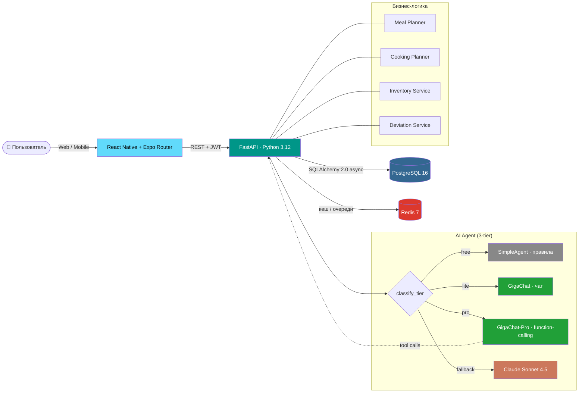

<div align="center">

# 🥗 КБЖУЙ

### Персональный ИИ-навигатор питания

> «Приготовь один раз — не думай потом»

[](https://python.org)
[](https://fastapi.tiangolo.com)
[](https://reactnative.dev)
[](https://expo.dev)
[](https://postgresql.org)
[](https://redis.io)
[](https://docker.com)
[](https://developers.sber.ru/portal/products/gigachat)
[](https://anthropic.com)

</div>

---

## 💡 Что это

**КБЖУЙ** — приложение для людей, которые хотят питаться правильно, но не готовы тратить часы каждый день на готовку, подсчёт калорий и продумывание меню.

Принцип: один раз в неделю — большая «батч-готовка». Заготовки раскладываются по пронумерованным контейнерам (1А, 2Б…). Дальше приложение каждый день говорит:

> *Сегодня в 13:00 — обед. Возьми контейнер **2А** из холодильника, разогрей 2 минуты в микроволновке.*

ИИ-агент — встроенный исполнитель. Он не просто советует, а **реально меняет план в БД**: переносит приёмы пищи, перекладывает контейнеры в морозилку, регистрирует отклонения, пересчитывает дневные нормы. Через function-calling.

---

## ✨ Ключевые фичи

| 🎯 | План питания на неделю под индивидуальные КБЖУ-цели (похудение / поддержание / набор) |
|---|---|
| 🍲 | Автоматический план батч-готовки: какие блюда готовить, в каком порядке, с распараллеливанием шагов |
| 📦 | Учёт остатков в холодильнике / морозилке / шкафу — приложение знает, что у вас уже есть |
| 🛒 | Список покупок строится автоматически из плана |
| 🤖 | **Агент-исполнитель** на GigaChat-Pro / Claude — function-calling, реально меняет план |
| 💬 | Персистентная история чата — переключаешь вкладки, перезагружаешь — всё на месте |
| 🔄 | 3-уровневый роутинг агента (free → lite → pro) — экономит токены на простых вопросах |
| 🏷️ | Уникальная UX-идея: пронумерованные контейнеры **1А = понедельник, обед** — никаких вопросов «что есть» |

---

## 🤖 Как работает агент

Агент — это не текстовый болтун, а **инструмент-исполнитель**. На каждое сообщение он либо отвечает текстом (если просто вопрос «что у меня сегодня»), либо делает **цепочку tool-вызовов**, реально меняя данные.

### Пример: «Завтра планирую поужинать бургером»

```
1. update_meal_status(meal_id=8750, status='skipped', reason='заменил на бургер')
   → Помечает завтрашний ужин как пропущенный

2. register_deviation(description='бургер вместо ужина', kcal=700, protein_g=40, fat_g=35, carbs_g=60)
   → Записывает отклонение, возвращает {id: 47}

3. recalculate_plan(deviation_id=47)
   → Распределяет «лишние» 700 ккал по остатку недели,
     пересчитывает дневные нормы

4. update_container(container_label='4 ПН', status='frozen', note='заменён на бургер')
   → Переводит контейнер с приготовленным ужином в морозилку

5. Текстовый ответ: «✅ Заменил ужин на бургер (≈700 ккал).
   Контейнер 4 ПН в морозилку. Норма скорректирована: 1450 ккал/день
   вместо 1514 ккал/день».
```

Всё это происходит за один запрос к чату. Никаких ручных кнопок.

### 3-уровневый роутинг (экономия токенов)

Чтобы не сжигать GigaChat-Pro на простых вопросах, каждое сообщение классифицируется:

| Уровень | Модель | Когда срабатывает | Цена |
|---|---|---|---|
| **🆓 free** | SimpleAgent (правила) | «Что у меня сегодня?», «Привет», «Что скоро испортится?» | 0 токенов |
| **💡 lite** | GigaChat (без tools) | Общие вопросы про питание: «можно ли есть углеводы вечером?» | дёшево |
| **🚀 pro** | GigaChat-Pro + function-calling | Действия: «съел пиццу», «завтра ресторан», «перестрой план» | дороже, но реально работает |

Классификация — в [`gigachat_agent.py:classify_tier()`](backend/app/ai/gigachat_agent.py). Триггер «pro»: ключевые слова действий (`перестрой`, `перенеси`, `в морозилку`), временные маркеры с типом приёма пищи (`завтра ужин X`), интенты вроде «съел/выпил не по плану».

### Доступные tools

| Tool | Назначение |
|---|---|
| `get_user_profile` | Цели, КБЖУ-нормы, расписание питания |
| `get_today_plan` | Сегодняшний план с meal_id и контейнерами |
| `get_week_plan` | Полный недельный план — для поиска нужного приёма по дате |
| `get_storage` | Все контейнеры со сроками годности |
| `get_expiring_soon` | Что испортится в ближайшие 2 дня |
| `update_meal_status` | Пометить приём как `eaten` / `skipped` / `planned` |
| `update_container` | Изменить статус контейнера (`frozen` / `eaten` / `expired`) + заметка |
| `register_deviation` | Записать отклонение с КБЖУ-эффектом |
| `recalculate_plan` | Перераспределить лишние ккал по остатку недели |
| `build_meal_plan` | Сгенерировать новый план с нуля (только при явном запросе) |

---

## 🚀 Быстрый старт

Нужен только **Docker Desktop**. Больше ничего ставить не нужно — ни Python, ни Node.

```bash
git clone https://github.com/PolyaRoz/kbzhuy.git
cd kbzhuy

# Windows
start.bat

# macOS / Linux
chmod +x start.sh stop.sh
./start.sh
```

После запуска:

| Сервис | URL |
|---|---|
| 🌐 Веб-приложение | <http://localhost:8081> |
| ⚙️ Backend API | <http://localhost:8000> |
| 📚 Swagger UI | <http://localhost:8000/docs> |

Первый запуск собирает Docker-образы (~3–5 минут — Node-зависимости + Python-зависимости). Дальнейшие запуски — мгновенно.

### Включить агента (GigaChat)

> ⚠️ **Для проверяющих:** креды автора в репозитории отсутствуют (файл `.env.gigachat` в `.gitignore` и никогда не коммитился). Нужны **свои** креды от Sber Studio — иначе приложение запустится со статическим SimpleAgent (всё работает, кроме умного чата).

Без агента приложение работает полностью — кроме чата (там будет SimpleAgent с заготовленными ответами). Чтобы включить полноценного агента-исполнителя:

1. Получи ключ авторизации на <https://developers.sber.ru/studio> → GigaChat API → Settings → Authorization
2. Скопируй шаблон и впиши свой ключ:

   ```bash
   cp .env.gigachat.example .env.gigachat
   # потом в .env.gigachat поставь USE_GIGACHAT=true и вставь свой CREDENTIALS
   ```

3. Перезапусти API:

   ```bash
   # Windows
   gigachat-on.bat

   # любая ОС
   docker compose -f infra/docker-compose.dev.yml up -d --no-deps api
   ```

Чтобы выключить (например, чтобы не тратить токены на тестах): `gigachat-off.bat` (Windows) или просто поставь `KBZHUY_USE_GIGACHAT=false` в файле и перезапусти API.

> **Альтернатива:** Anthropic Claude. Поставь `KBZHUY_ANTHROPIC_API_KEY=...` в `backend/.env` — будет использоваться Claude Sonnet вместо GigaChat (приоритет: GigaChat > Claude > Ollama > SimpleAgent).

### Остановить

```bash
# Windows
stop.bat

# macOS / Linux
./stop.sh
```

Полный сброс БД: `docker compose -f infra/docker-compose.dev.yml down -v`

---

## 🧱 Архитектура



**Поток при сообщении в чат:**

1. Mobile/Web отправляет `POST /agent/chat {message, history}` с JWT
2. `_get_agent()` смотрит `KBZHUY_USE_GIGACHAT`, классифицирует сообщение → выбирает уровень
3. Если **pro**: GigaChat-Pro получает 10 функций + контекст с meal_id/контейнерами на сегодня и завтра
4. Модель возвращает `function_call` → backend выполняет tool в БД → результат отправляется обратно
5. Цикл до 6 итераций или пока модель не вернёт текстовый ответ
6. Полный traceback логируется при любой ошибке (`kbzhuy.gigachat`, `kbzhuy.agent_route`)

**Поток при создании плана:**

1. Пользователь проходит онбординг → профиль (рост, вес, цель, активность)
2. `nutri_service` рассчитывает дневные КБЖУ по формуле Миффлина–Сан Жеора с поправкой на цель
3. `meal_planner_service` подбирает рецепты из базы (~50 валидированных рецептов) под целевые КБЖУ
4. `cooking_planner_service` группирует рецепты в батч-сессии, считает шаги готовки, определяет фасовку по контейнерам
5. Из агрегированных ингредиентов строится список покупок

---

## 🛠️ Стек

| Слой | Технологии |
|---|---|
| **Frontend** | React Native 0.76, Expo Router 4, TypeScript, Zustand (+ persist), Axios, React Query |
| **Backend** | FastAPI, Pydantic v2, SQLAlchemy 2.0 (async), Alembic, JWT |
| **БД / кеш** | PostgreSQL 16, Redis 7 |
| **AI (основной)** | **GigaChat-Pro** (Sber) + function-calling через `gigachat` SDK |
| **AI (запасной)** | Claude Sonnet 4.5 (Anthropic SDK) или локальный LLM через Ollama |
| **Хранение чата** | localStorage (web) / AsyncStorage (mobile) через Zustand store |
| **Инфраструктура** | Docker Compose, Nginx (статика), Multi-stage Docker builds |

---

## 📁 Структура проекта

```
kbzhuy/
├── backend/                     ← FastAPI приложение
│   ├── app/
│   │   ├── api/v1/              ← роуты: auth, plan, cooking, storage, shopping, agent
│   │   ├── services/            ← бизнес-логика (meal_planner, cooking_planner, nutri, deviation)
│   │   ├── models/              ← SQLAlchemy модели (User, Plan, Meal, Container, ...)
│   │   ├── schemas/             ← Pydantic схемы запросов/ответов
│   │   ├── ai/                  ← AI-агенты:
│   │   │   ├── simple_agent.py        ← rule-based (free tier)
│   │   │   ├── gigachat_agent.py      ← GigaChat + classify_tier (lite + pro)
│   │   │   ├── agent.py               ← Claude/Ollama backend + tool implementations
│   │   │   └── tools.py               ← OpenAI- и Anthropic-совместимые описания tools
│   │   └── core/                ← config, security, database, logging
│   ├── migrations/              ← Alembic миграции
│   └── requirements.txt
│
├── mobile/                      ← React Native + Expo Router
│   ├── app/(tabs)/              ← экраны: Дом, План, Готовка, Хранение, Покупки, Агент, Профиль
│   ├── app/onboarding/          ← 4-шаговый онбординг
│   └── src/
│       ├── api/                 ← axios-клиент (timeout 60s) + типизированные клиенты
│       ├── store/               ← Zustand: authStore, planStore, chatStore (persistent), ...
│       └── components/          ← AgentWidget (плавающий чат), KbzhuBar, ContainerBadge, ...
│
├── infra/
│   ├── docker-compose.dev.yml   ← локальный стек (db, redis, api, web) + env_file
│   ├── Dockerfile.web           ← multi-stage сборка фронта в nginx-контейнер
│   └── nginx/web.conf           ← конфиг Nginx
│
├── data/
│   ├── recipes/                 ← база рецептов (JSON + структурированный markdown)
│   └── nutrition/               ← КБЖУ-таблицы продуктов
│
├── docs/                        ← внутренняя документация (tracker, architecture, decisions)
├── .env.gigachat                ← GigaChat-токен (gitignored, шаблон в README)
├── gigachat-on.bat              ← включить агента (Windows)
├── gigachat-off.bat             ← выключить агента
├── start.bat / start.sh         ← запуск одной командой
└── README.md                    ← этот файл
```

---

## 🗺️ Roadmap

| Фаза | Что | Статус |
|---|---|---|
| **MVP** | Auth, профиль, генерация плана, покупки, готовка, хранение | ✅ Завершено |
| **AI-агент** | Tool-use, контекстный диалог, перестроение плана, GigaChat-Pro | ✅ Завершено |
| **3-tier роутинг** | Free / lite / pro для оптимизации токенов | ✅ Завершено |
| **Persistent чат** | История переживает перезагрузки и переключение вкладок | ✅ Завершено |
| **Хранение 2.0** | Сроки годности, использование «по кнопке», умные предупреждения | ✅ Завершено |
| **Запуск** | Push-уведомления, оффлайн-режим, App Store / Google Play | ⬜ Запланировано |

Подробнее — [`docs/tracker.md`](docs/tracker.md) и [`docs/implementation_plan.md`](docs/implementation_plan.md).

---

## 🧪 Локальная разработка без Docker (опционально)

Если вы хотите дорабатывать backend с hot-reload:

```bash
# 1. Поднять только инфраструктуру (db + redis)
docker compose -f infra/docker-compose.dev.yml up -d db redis

# 2. Создать venv и накатить миграции
cd backend
python -m venv .venv
source .venv/bin/activate          # Windows: .venv\Scripts\activate
pip install -r requirements.txt
cp .env.example .env
alembic upgrade head

# 3. Запустить uvicorn с автоперезагрузкой
uvicorn app.main:app --reload --port 8000
```

Mobile-разработка с горячим обновлением:

```bash
cd mobile
npm install
npx expo start --web              # откроется на http://localhost:19006
```

Логи агента в реальном времени:

```bash
docker compose -f infra/docker-compose.dev.yml logs -f api | grep gigachat
```

---

## 👤 Автор

Полина Розанова  ·  [@PolyaRoz](https://github.com/PolyaRoz)

Создано в рамках конкурса от Сбера.

---

> © 2026 Полина Розанова. Все права защищены.
> Проект публикуется в демонстрационных целях. Использование, копирование или распространение кода без письменного разрешения автора запрещено.
