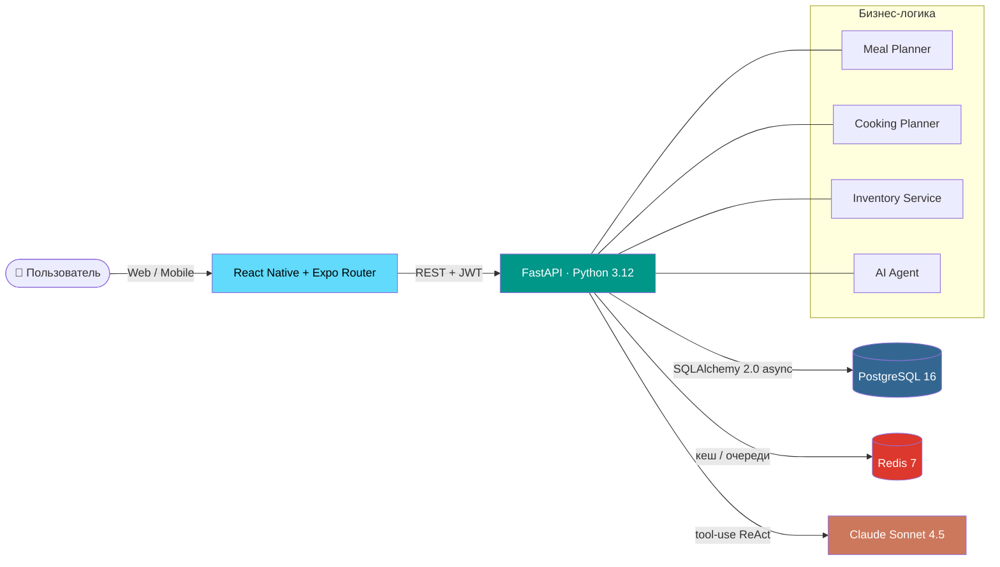

<div align="center">

# 🥗 КБЖУЙ

### Персональный ИИ-навигатор питания

> «Приготовь один раз — не думай потом»

[](https://python.org)
[](https://fastapi.tiangolo.com)
[](https://reactnative.dev)
[](https://expo.dev)
[](https://postgresql.org)
[](https://redis.io)
[](https://docker.com)
[](https://anthropic.com)

</div>

---

## 💡 Что это

**КБЖУЙ** — приложение для людей, которые хотят питаться правильно, но не готовы тратить часы каждый день на готовку, подсчёт калорий и продумывание меню.

Принцип: один раз в неделю — большая «батч-готовка». Заготовки раскладываются по пронумерованным контейнерам (1А, 2Б…). Дальше приложение каждый день говорит:

> *Сегодня в 13:00 — обед. Возьми контейнер **2А** из холодильника, разогрей 2 минуты в микроволновке.*

ИИ-агент перестраивает план под отклонения: пиво в пятницу, ресторан с друзьями, неудачный день — рацион автоматически адаптируется без потери цели.

---

## ✨ Ключевые фичи

| 🎯 | План питания на неделю под индивидуальные КБЖУ-цели (похудение / поддержание / набор) |
|---|---|
| 🍲 | Автоматический план батч-готовки: какие блюда готовить, в каком порядке, с распараллеливанием шагов |
| 📦 | Учёт остатков в холодильнике / морозилке / шкафу — приложение знает, что у вас уже есть |
| 🛒 | Список покупок строится автоматически из плана |
| 🤖 | ИИ-агент (Claude Sonnet 4.5) на ReAct-паттерне: помогает, объясняет, перестраивает план |
| 🔄 | Пересборка плана при отклонениях — съели не по плану? Агент пересчитает остаток дня |
| 🏷️ | Уникальная UX-идея: пронумерованные контейнеры **1А = понедельник, обед** — никаких вопросов «что есть» |

---

## 🚀 Быстрый старт

Нужен только **Docker Desktop**. Больше ничего ставить не нужно — ни Python, ни Node.

```bash
git clone https://github.com/PolyaRoz/kbzhuy.git
cd kbzhuy

# Windows
start.bat

# macOS / Linux
chmod +x start.sh stop.sh
./start.sh
```

После запуска:

| Сервис | URL |
|---|---|
| 🌐 Веб-приложение | <http://localhost:8081> |
| ⚙️ Backend API | <http://localhost:8000> |
| 📚 Swagger UI | <http://localhost:8000/docs> |

Первый запуск собирает Docker-образы (~3–5 минут — Node-зависимости + Python-зависимости). Дальнейшие запуски — мгновенно.

> **AI-агент опционален.** Без `KBZHUY_ANTHROPIC_API_KEY` приложение работает полностью кроме чата с агентом. Чтобы включить чат — впишите ключ в `backend/.env` (получить можно на <https://console.anthropic.com/>).

### Остановить

```bash
# Windows
stop.bat

# macOS / Linux
./stop.sh
```

Полный сброс БД: `docker compose -f infra/docker-compose.dev.yml down -v`

---

## 🧱 Архитектура



**Поток данных при создании плана:**

1. Пользователь проходит онбординг → профиль (рост, вес, цель, активность)
2. `nutri_service` рассчитывает дневные КБЖУ по формуле Миффлина–Сан Жеора с поправкой на цель
3. `meal_planner_service` подбирает рецепты из базы (~50 валидированных рецептов) под целевые КБЖУ
4. `cooking_planner_service` группирует рецепты в батч-сессии, считает шаги готовки, определяет фасовку по контейнерам
5. Из агрегированных ингредиентов строится список покупок

---

## 🛠️ Стек

| Слой | Технологии |
|---|---|
| **Frontend** | React Native 0.76, Expo Router 4, TypeScript, Zustand, Axios, React Query |
| **Backend** | FastAPI, Pydantic v2, SQLAlchemy 2.0 (async), Alembic, JWT |
| **БД / кеш** | PostgreSQL 16, Redis 7 |
| **AI** | Claude Sonnet 4.5 (Anthropic SDK), ReAct + tool-use, опц. локальный LLM через Ollama |
| **Инфраструктура** | Docker Compose, Nginx (статика), Multi-stage Docker builds |

---

## 📁 Структура проекта

```
kbzhuy/
├── backend/                     ← FastAPI приложение
│   ├── app/
│   │   ├── api/v1/              ← роуты: auth, plan, cooking, storage, shopping, agent
│   │   ├── services/            ← бизнес-логика (meal_planner, cooking_planner, nutri, ...)
│   │   ├── models/              ← SQLAlchemy модели (User, Plan, Meal, Container, ...)
│   │   ├── schemas/             ← Pydantic схемы запросов/ответов
│   │   ├── ai/                  ← AI-агент: tools, ReAct loop, system prompt
│   │   └── core/                ← config, security, database
│   ├── migrations/              ← Alembic миграции
│   └── requirements.txt
│
├── mobile/                      ← React Native + Expo Router
│   ├── app/(tabs)/              ← экраны: Дом, План, Готовка, Хранение, Покупки, Агент, Профиль
│   ├── app/onboarding/          ← 4-шаговый онбординг
│   └── src/
│       ├── api/                 ← axios-клиент + типизированные клиенты к каждому ресурсу
│       ├── store/               ← Zustand: authStore, planStore, shoppingStore, storageStore
│       └── components/          ← общие UI-компоненты
│
├── infra/
│   ├── docker-compose.dev.yml   ← локальный стек (db, redis, api, web)
│   ├── Dockerfile.web           ← multi-stage сборка фронта в nginx-контейнер
│   └── nginx/web.conf           ← конфиг Nginx
│
├── data/
│   ├── recipes/                 ← база рецептов (JSON + структурированный markdown)
│   └── nutrition/               ← КБЖУ-таблицы продуктов
│
├── docs/                        ← внутренняя документация (tracker, architecture, decisions)
├── start.bat / start.sh         ← запуск одной командой
└── README.md                    ← этот файл
```

---

## 🗺️ Roadmap

| Фаза | Что | Статус |
|---|---|---|
| **MVP** | Auth, профиль, генерация плана, покупки, готовка, хранение | ✅ Завершено |
| **AI-агент** | Claude tool-use, контекстный диалог, перестроение плана | 🔄 В работе |
| **Хранение 2.0** | Сроки годности, использование «по кнопке», умные предупреждения | ✅ Завершено |
| **Запуск** | Push-уведомления, оффлайн-режим, App Store / Google Play | ⬜ Запланировано |

Подробнее — [`docs/tracker.md`](docs/tracker.md) и [`docs/implementation_plan.md`](docs/implementation_plan.md).

---

## 🧪 Локальная разработка без Docker (опционально)

Если вы хотите дорабатывать backend с hot-reload:

```bash
# 1. Поднять только инфраструктуру (db + redis)
docker compose -f infra/docker-compose.dev.yml up -d db redis

# 2. Создать venv и накатить миграции
cd backend
python -m venv .venv
source .venv/bin/activate          # Windows: .venv\Scripts\activate
pip install -r requirements.txt
cp .env.example .env
alembic upgrade head

# 3. Запустить uvicorn с автоперезагрузкой
uvicorn app.main:app --reload --port 8000
```

Mobile-разработка с горячим обновлением:

```bash
cd mobile
npm install
npx expo start --web              # откроется на http://localhost:19006
```

---

## 👤 Автор

Полина Розанова  ·  [@PolyaRoz](https://github.com/PolyaRoz)

Создано в рамках конкурса от Сбера.

---

> © 2026 Полина Розанова. Все права защищены.
> Проект публикуется в демонстрационных целях. Использование, копирование или распространение кода без письменного разрешения автора запрещено.
